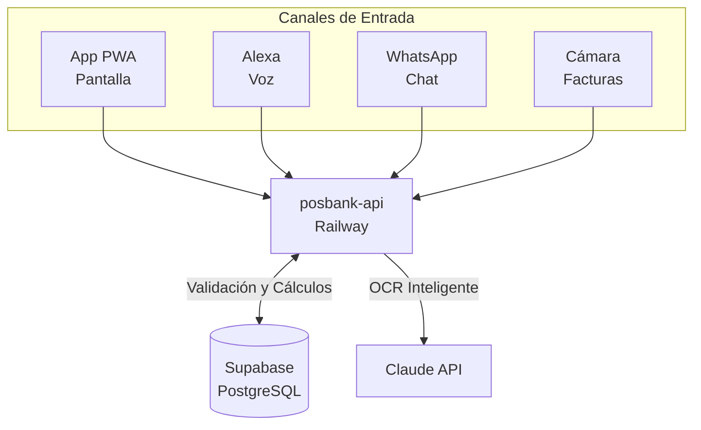

# Arquitectura: PosBank

**Actualizado:** Septiembre 2026
**Descripción:** Radar de flujo de caja y gestión financiera por voz/chat (Producto hermano).

## Tech Stack
* **Frontend (App):** React + Vite (Instalable PWA)
* **Backend (API):** Node.js / Express alojado en Railway (`posbank-api`)
* **Base de Datos:** Supabase (PostgreSQL) con seguridad por fila (RLS) y Auth (Correo/Google). Tiempo real vía Supabase Realtime.
* **Terceros:** 
  * Anthropic (Claude API para lectura de facturas por foto)
  * Amazon Alexa Skills Kit (Voz ↔ backend)
  * Meta WhatsApp Cloud API (Interacción por chat)

## Diagrama de Flujo (Mermaid)

## Arquitectura de Procesamiento
Cualquier consulta (sin importar el canal) entra a `posbank-api`. El API valida al usuario, `CashEngine` calcula el estado financiero, y `AlertEngine` revisa si hay notificaciones pendientes. La respuesta regresa al usuario en menos de 1.5 segundos.
