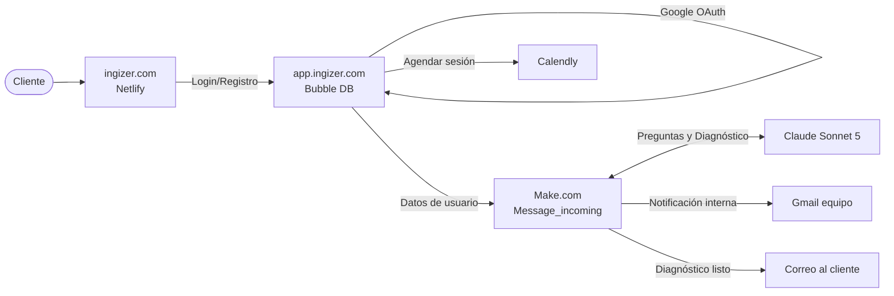

# Arquitectura: iNGIZER

**Actualizado:** Septiembre 2026
**Descripción:** Plataforma principal de diagnóstico y dirección financiera.

## Tech Stack
* **Landing Page:** Netlify (Página estática en `ingizer.com`)
* **Frontend y Base de Datos:** Bubble (`app.ingizer.com`) - Maneja Autenticación (Google OAuth), Chats, y registros de Análisis Financiero.
* **Orquestación:** Make.com (Escenarios `Message_incoming`, webhook desde Bubble).
* **IA y Razonamiento:** Anthropic (Claude Sonnet 5) consumido a través de Make AI Agents.

## Diagrama de Flujo (Mermaid)

## Flujo de Usuarios
1. **Registro:** Captura de sector, número de empleados y descripción de la empresa.
2. **Módulo General:** 11 preguntas (modelo de negocio, flujo de caja).
3. **Ramas:** Derivación automática según el estado (Emprendimiento, Negocio andando, Creciendo rápido).
4. **Generación:** Make.com reintenta automáticamente si hay error 429 de Anthropic. El registro `save_analysis` se crea en Bubble.
5. **Conversión:** El cliente ve su canvas y semáforos financieros, y agenda vía Calendly.
