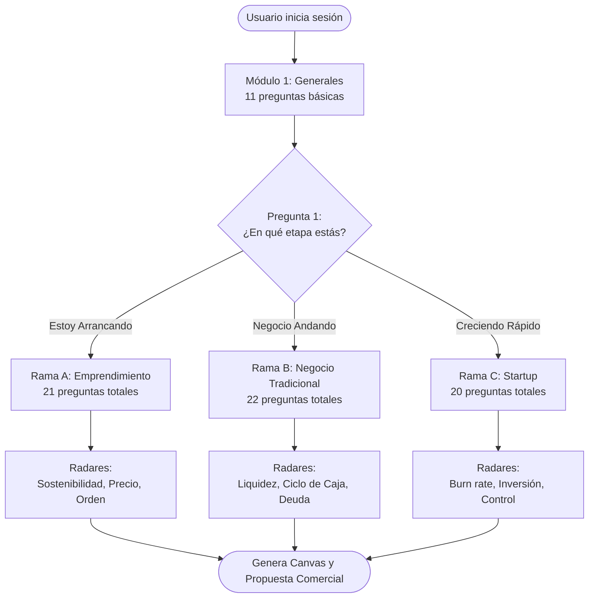

# Estructura del Diagnóstico IA (iNGIZER)

**Descripción:** Flujo lógico de las preguntas que realiza el agente de Anthropic al usuario para generar el análisis financiero.

## Resumen del Árbol de Decisión
El asistente perfila al usuario con un Módulo General (Módulo 1). Dependiendo de la respuesta a la Pregunta 1, el asistente se bifurca en 3 ramas especializadas. Cada rama emite un diagnóstico y semáforos distintos.

## Gráfico Lógico (Mermaid)

## Datos adicionales del Prompt
* **Datos previos:** Sector, número de empleados y descripción de la empresa ya se capturan en el registro y se inyectan silenciosamente al prompt.
* **Reducción de fatiga:** El cuestionario original tenía 30 preguntas fijas. Ahora cada usuario responde un máximo de 20 a 22 preguntas según su rama.
