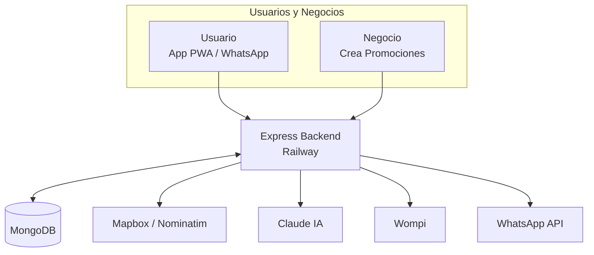

# Arquitectura: igeogo

**Actualizado:** Septiembre 2026
**Descripción:** Plataforma de marketing de proximidad (Producto hermano).

## Tech Stack
* **Backend:** Node.js / Express alojado en Railway (Proceso 24/7)
* **Base de Datos:** MongoDB
* **Canales de Acceso:** Landings Web, WhatsApp Bot, App PWA (usuarios/negocios), Panel Admin interno.
* **Integraciones:**
  * **Mapas y Geocoding:** Mapbox + Nominatim
  * **IA:** Claude (Para redacción de campañas)
  * **Pagos:** Wompi
  * **Comunicaciones:** Meta Cloud API (WhatsApp)

## Diagrama de Flujo (Mermaid)

## Flujo de Jornada
1. **Negocio:** Crea promoción (ej. Almuerzo ejecutivo), la IA le ayuda a redactar la campaña, y paga a través de Wompi.
2. **Usuario:** Comparte su zona vía WhatsApp o Web, elige categorías (Comida, salud, etc.) y recibe las promociones de los negocios cercanos calculadas mediante MongoDB y Mapbox.
